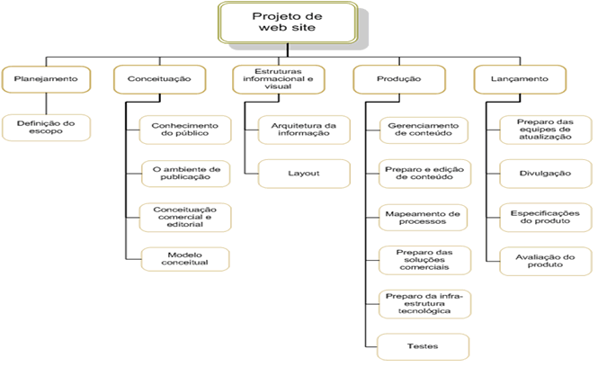

# 📋 Planejamento

**Versão:** 1.0  
**Data de Criação:** Dezembro 2025  
**Última Atualização:** Dezembro 14, 2025  
**Responsável:** Júlia de Mello (Scrum Master)  
**Status:** ✅ Completo

---

> A fase de planejamento na gerência de projetos é um momento onde os detalhes do projeto são minuciosamente definidos para garantir uma execução bem-sucedida. 
> Durante essa etapa, os gerentes de projeto e suas equipes elaboram um plano abrangente que aborda aspectos como cronograma, orçamento, recursos necessários, riscos identificados e métodos de controle. 
> O objetivo é criar uma estrutura que guiará as atividades ao longo do projeto, garantindo que metas sejam alcançadas de maneira eficiente. 
> O plano de projeto não apenas define as tarefas específicas e suas interdependências, mas também estabelece critérios de sucesso e indicadores de desempenho. 
> A qualidade do planejamento influencia diretamente a capacidade da equipe em cumprir prazos, alocar recursos eficientemente e lidar com desafios que possam surgir durante a execução.

# Estrutura do Documento

- [Fase de Planejamento](#planejamento)
- [Escopo do Projeto](#escopo-do-projeto)
- [Estrutura Analítica do Projeto](#estrutura-analítica-do-projeto)
- [Matriz de Responsabilidades](#matriz-de-responsabilidades)
- [Cronograma do Projeto](#cronograma-do-projeto)
- [Orçamento do Projeto](#orçamento-do-projeto)
- [Planos de Gerenciamento](#planos-de-gerenciamento)
  - [Plano de Qualidade](#plano-de-qualidade)
  - [Plano de Aquisição](#plano-de-aquisição)
  - [Plano de Comunicação](#plano-de-comunicação)
  - [Plano de Riscos](#plano-de-riscos)

-----

# 🎯 Escopo do Projeto

O **HiperCompras** é um aplicativo web desenvolvido para facilitar as compras no supermercado HiperBarato, oferecendo aos clientes uma experiência digital prática e eficiente. O sistema permitirá que os usuários naveguem pelo catálogo de produtos, adicionem itens ao carrinho de compras, acumulem pontos de fidelidade e gerenciem suas compras de forma online, com retirada presencial no estabelecimento.

**Objetivo Principal:**  
Criar uma plataforma digital que simplifique o processo de compras, aumentando o fluxo de consumidores durante a semana e fortalecendo o programa de fidelidade do supermercado através de um sistema de pontuação integrado.

**Principais Funcionalidades:**
- Sistema de cadastro e autenticação de usuários
- Catálogo completo de produtos com busca e filtragem
- Carrinho de compras virtual
- Sistema de acúmulo de pontos por compra
- Funcionalidade de pré-pagamento do estacionamento
- Possibilidade de reserva de vagas no estacionamento
- Interface responsiva e intuitiva

**Entregas Principais:**
- Frontend desenvolvido em React.js com design responsivo
- Backend em Node.js com API REST
- Banco de dados SQLite para persistência de informações
- Sistema integrado de usuários, produtos e pontos
- Documentação completa do projeto

**Exclusões do Escopo:**
- Entrega a domicílio (apenas retirada no supermercado)
- Pagamento online pelo aplicativo (pagamento na retirada)
- Edição de dados cadastrais dos usuários
- Integração com sistemas reais de pagamento/logística

# 📊 Estrutura Analítica do Projeto

A Estrutura Analítica do Projeto (EAP) do HiperCompras organiza todas as entregas e atividades necessárias para o desenvolvimento completo da aplicação. A estrutura está dividida em cinco grandes fases, conforme a metodologia de gerenciamento de projetos adotada:

**1. Iniciação**
   - Definição do problema e objetivos
   - Identificação das partes interessadas
   - Elaboração do Termo de Abertura do Projeto
   - Estimativas iniciais de custo e prazo
   - Definição de requisitos funcionais e não funcionais

**2. Planejamento**
   - Elaboração da Estrutura Analítica do Projeto (WBS)
   - Definição da Matriz de Responsabilidades (RACI)
   - Criação do cronograma detalhado
   - Planejamento do orçamento
   - Planos de gerenciamento (Qualidade, Aquisição, Comunicação e Riscos)

**3. Execução - Desenvolvimento do Sistema**
   - **Backend Development**
     - Configuração do ambiente Node.js
     - Implementação da API REST
     - Desenvolvimento do sistema de autenticação
     - Criação do banco de dados SQLite
     - Desenvolvimento das rotas de produtos, usuários e carrinho
     - Sistema de pontos e fidelidade
   - **Frontend Development**
     - Estruturação do projeto React
     - Desenvolvimento das páginas (Home, Login, Cadastro, Produtos, Carrinho)
     - Implementação dos componentes reutilizáveis
     - Design responsivo e estilização CSS
     - Integração com a API backend
   - **Testes e Qualidade**
     - Testes unitários
     - Testes de integração
     - Testes de usabilidade

**4. Monitoramento e Controle**
   - Acompanhamento do cronograma
   - Controle de qualidade
   - Gestão de mudanças
   - Relatórios de progresso
   - Reuniões de acompanhamento

**5. Encerramento**
   - Entrega final do sistema
   - Documentação completa
   - Lições aprendidas
   - Apresentação do projeto

**Pacotes de Trabalho Principais:**
- **WP1:** Configuração de Infraestrutura (Git, Node.js, React)
- **WP2:** Desenvolvimento do Backend (API, Database, Autenticação)
- **WP3:** Desenvolvimento do Frontend (Interfaces, Componentes, Estilos)
- **WP4:** Integração de Sistemas (Frontend + Backend + Database)
- **WP5:** Testes e Garantia de Qualidade
- **WP6:** Documentação e Entrega

### Representação Visual da WBS

> **Softwares recomendados para criar a WBS:**
> - [WBS Schedule Pro (Demo)](https://www.criticaltools.com/)
> - [Draw.io](https://app.diagrams.net/)
> - [ProjectLibre](https://www.projectlibre.com/)

-----

# Matriz de Responsabilidades

## Matriz RACI do Projeto

### Arquivos relacionados
- **Imagem da Matriz RACI:**  
  `images/Matriz RACI.pdf.png`

- **PDF completo da Matriz RACI:**  
  [Matriz RACI.pdf](docs/02-planejamento/Matriz%20RACI.pdf)

- **Arquivo CSV (editável) da Matriz RACI:**  
 [matriz_raci.csv](docs/02-planejamento/matriz_raci.csv)

### Descrição da Matriz RACI

A Matriz de Responsabilidades (RACI) do projeto HiperCompras define claramente os papéis e responsabilidades de cada membro da equipe em relação às principais atividades do projeto:

- **R (Responsável):** Quem executa a atividade
- **A (Aprovador/Accountable):** Quem tem autoridade final sobre a atividade
- **C (Consultado):** Quem fornece informações ou expertise
- **I (Informado):** Quem precisa ser mantido atualizado

Esta estrutura garante clareza de papéis, evita duplicação de esforços e facilita a comunicação dentro da equipe.

-----

# 📅 Cronograma do Projeto

O cronograma do projeto HiperCompras foi estruturado para um período de execução de **60 horas** de trabalho, distribuídas entre **28 de agosto de 2025** e **04 de dezembro de 2025**. O desenvolvimento segue uma abordagem ágil com sprints semanais, permitindo entregas incrementais e ajustes contínuos.

**Fases Principais:**

**Fase 1: Iniciação (Semana 1-2)**
- Kickoff do projeto e alinhamento da equipe
- Definição do escopo e requisitos
- Elaboração do Termo de Abertura
- Identificação das partes interessadas
- Configuração inicial do ambiente de desenvolvimento

**Fase 2: Planejamento (Semana 3-4)**
- Elaboração da WBS e cronograma detalhado
- Definição da Matriz RACI
- Planejamento de riscos e qualidade
- Definição da arquitetura do sistema
- Prototipagem das interfaces (UI/UX)

**Fase 3: Execução - Desenvolvimento (Semana 5-12)**
- Sprint 1-2: Configuração do backend (Node.js + SQLite)
- Sprint 3-4: Desenvolvimento das rotas da API REST
- Sprint 5-6: Desenvolvimento do frontend React (páginas principais)
- Sprint 7-8: Integração frontend-backend e sistema de autenticação
- Sprint 9-10: Implementação do sistema de pontos e carrinho
- Sprint 11-12: Refinamentos e ajustes de usabilidade

**Fase 4: Monitoramento e Testes (Semana 13-14)**
- Testes de integração e funcionalidades
- Testes de usabilidade e responsividade
- Correção de bugs identificados
- Validação com stakeholders

**Fase 5: Encerramento (Semana 15-16)**
- Preparação da documentação final
- Apresentação do projeto
- Entrega dos artefatos
- Retrospectiva e lições aprendidas

**Marcos Críticos:**
- **M1:** Conclusão do planejamento e aprovação do escopo (Semana 4)
- **M2:** Backend funcional com API completa (Semana 7)
- **M3:** Frontend integrado e responsivo (Semana 10)
- **M4:** Sistema completo testado e validado (Semana 14)
- **M5:** Entrega final e apresentação (Semana 16)

**Dependências Críticas:**
- O desenvolvimento do frontend depende da conclusão das rotas da API
- Os testes de integração dependem da conclusão de ambos frontend e backend
- A validação final depende da conclusão de todos os testes

### Documento 

- [Cronograma e Orçamento do Projeto](artefatos/HiperCompras.pod)

-----

# 💰 Orçamento do Projeto

O orçamento realista do projeto HiperCompras é de **R$ 0,00 (zero reais)**. Como atividade acadêmica, todo o trabalho foi realizado com tempo e esforço dos integrantes, sem custos financeiros diretos.

**Detalhamento dos Custos (real):**

**1. Recursos Humanos (R$ 0,00 – esforço acadêmico)**
- Integrantes contribuíram com cerca de 60 horas no total
- Sem remuneração financeira; foco em aprendizado e entrega

**2. Infraestrutura e Hospedagem (R$ 0,00)**
- Desenvolvimento em ambiente local
- Hospedagem e domínio não utilizados ou em planos gratuitos

**3. Ferramentas e Tecnologias (R$ 0,00 – 100% gratuitas)**
- Node.js, React.js, SQLite, VS Code, Git/GitHub, Express.js
- Figma em plano educacional gratuito

**Custo Total do Projeto:** R$ 0,00

**Investimento Real:**
- Tempo e esforço dos membros da equipe
- Equipamentos pessoais
- Aprendizado e transferência de conhecimento

**Distribuição de Esforço por Fase (estimado):**
- Iniciação: 4h
- Planejamento: 8h
- Execução: 38h
- Monitoramento: 6h
- Encerramento: 4h

**Observações:**
- Todos os recursos e ferramentas utilizados foram gratuitos
- O projeto não incorreu em despesas financeiras

### Documento

- [Cronograma e Orçamento do Projeto](artefatos/HiperCompras.pod)

# 📌 Planos de Gerenciamento

> Os planos de gerenciamento do projetos consolidam as diretrizes e estratégias para a execução bem-sucedida de um empreendimento. 
> Ele abrange diversos aspectos, como escopo, cronograma, custos, riscos, qualidade, recursos humanos, comunicação e aquisições, proporcionando uma visão abrangente e integrada do projeto. 
> Este plano funciona como um guia mestre que orienta a equipe de projeto e as partes interessadas ao longo do ciclo de vida do projeto, estabelecendo expectativas, responsabilidades e processos. 
> Além disso, serve como um instrumento de comunicação, alinhando as expectativas entre os membros da equipe e as partes interessadas, mitigando riscos e fornecendo uma estrutura sólida para a tomada de decisões. 

## Plano de Qualidade

O Plano de Qualidade do projeto HiperCompras estabelece os critérios, processos e métricas que garantirão que o sistema atenda aos requisitos funcionais e não funcionais estabelecidos, proporcionando uma experiência satisfatória aos usuários finais.

**Objetivos de Qualidade:**
- Garantir que todas as funcionalidades implementadas atendam aos requisitos especificados
- Assegurar a responsividade e usabilidade da interface em diferentes dispositivos
- Manter a performance do sistema dentro dos padrões estabelecidos (tempo de resposta < 3s)
- Garantir a segurança dos dados dos usuários
- Assegurar a manutenibilidade e escalabilidade do código

**Padrões de Qualidade Adotados:**
- Código limpo e bem documentado
- Componentização e reutilização no React
- Padrões RESTful na construção da API
- Validação de dados em frontend e backend
- Tratamento adequado de erros e exceções
- Testes de funcionalidades críticas

**Processos de Garantia de Qualidade:**
1. **Revisão de Código (Code Review):** Toda funcionalidade desenvolvida passa por revisão de pelo menos um membro da equipe
2. **Testes Funcionais:** Validação de cada funcionalidade conforme especificação
3. **Testes de Integração:** Verificação da comunicação entre frontend, backend e banco de dados
4. **Testes de Usabilidade:** Avaliação da experiência do usuário
5. **Testes de Responsividade:** Verificação em diferentes tamanhos de tela
6. **Testes de Performance:** Medição dos tempos de resposta

**Métricas de Qualidade:**
- Taxa de defeitos encontrados vs. corrigidos
- Tempo médio de resposta das requisições
- Cobertura de testes (meta: >70%)
- Número de bugs críticos (meta: 0)
- Satisfação do cliente/usuário (avaliação final)
- Taxa de conclusão das funcionalidades planejadas

### Artefatos a serem verificados

| Artefato   | Tipo Verif. | Data        | Responsável | Métrica     | Data Correção | Ação Não Conform. | Resp. Avaliação | Resp. Correção |
|------------|-------------|-------------|-------------|-------------|---------------|-------------------|-----------------|----------------|
| API Backend | Funcional | Semanal | Pedro Vitor | Todas rotas funcionando | Imediata | Correção de bugs | Júlia | Pedro Vitor |
| Frontend React | Funcional | Semanal | Amanda | Componentes renderizando | Imediata | Refatoração | Júlia | Amanda |
| Integração | Integração | Quinzenal | Equipe | Comunicação frontend-backend | 2 dias | Revisão de endpoints | Júlia | Responsável |
| UI/UX Design | Inspeção | Contínua | Ariel | Conformidade com protótipo | Imediata | Ajustes visuais | Júlia | Ariel |
| Banco de Dados | Funcional | Semanal | Pedro Vitor | Integridade dos dados | Imediata | Correção de schema | Júlia | Pedro Vitor |
| Documentação | Revisão | Contínua | Todos | Clareza e completude | 1 dia | Atualização | Júlia | Autor |

### Padrões e Normas Utilizadas

| Nome       | Descrição   | 
|------------|-------------|
| RESTful API | Padrões REST para desenvolvimento da API backend |
| React Best Practices | Componentização, hooks e gestão de estado |
| Clean Code | Código limpo, legível e bem documentado |
| Git Flow | Controle de versão com branches e pull requests |
| Responsive Design | Design adaptável para diferentes dispositivos |

### Ambiente das Atividades de Qualidade

| Ambiente   | Descrição   | 
|------------|-------------|
| Desenvolvimento | Visual Studio Code + Node.js + React Dev Server |
| Testes | Navegadores (Chrome, Firefox, Edge) + Ferramentas de DevTools |
| Versionamento | Git/GitHub para controle de versão |
| Integração | API REST rodando localmente na porta 3000 |

### Equipe de Qualidade

| Nome       | Responsabilidade | 
|------------|------------------|
| Júlia de Mello | Scrum Master e responsável pelos testes gerais |
| Amanda Canizela | Testes de frontend e usabilidade |
| Pedro Vitor Caiafa | Testes de backend e integração |
| Ariel Inácio | Testes de UI/UX e responsividade |
| Equipe Completa | Revisão de código (code review) |

### Metodologias de Qualidade Utilizadas

| Nome       | Descrição   | 
|------------|-------------|
| Code Review | Revisão de código por pares antes do merge |
| Testes Manuais | Testes exploratórios e de usabilidade |
| Inspeção de Interface | Verificação de conformidade com protótipo UI/UX |
| Testes de Aceitação | Validação com stakeholders ao final de cada sprint |

## Plano de Aquisição

O Plano de Aquisições define o processo relacionado à aquisição de bens e serviços necessários para a execução do projeto HiperCompras. Este plano abrange a identificação de necessidades, a seleção de fornecedores, a elaboração de contratos, e a gestão do relacionamento com os fornecedores durante o ciclo de vida do projeto.

**Objetivo:**
Garantir a aquisição eficiente e eficaz dos recursos necessários, minimizando riscos e custos, promovendo a conformidade com prazos e padrões de qualidade.

**Produtos e Serviços a Adquirir:**

| Item | Descrição | Fornecedor | Prazo | Custo |
|------|-----------|-----------|-------|-------|
| Hospedagem | Servidor em nuvem para backend e banco de dados | Heroku/Vercel/AWS | Contínuo | R$ 60,00 |
| Domínio | Registro de domínio (se necessário) | GoDaddy/Namecheap | Projeto completo | Variável |
| Certificado SSL | Segurança de transmissão de dados | Let's Encrypt (gratuito) | Contínuo | Gratuito |
| Ferramentas de Design | Prototipagem UI/UX | Figma (plano educacional) | Projeto completo | Gratuito |
| Ambiente de Desenvolvimento | IDE e ferramentas de coding | Open Source (GitHub, VSCode) | Contínuo | Gratuito |

**Critérios de Seleção de Fornecedores:**
- Confiabilidade e histórico de uptime
- Suporte técnico responsivo
- Conformidade com LGPD (proteção de dados)
- Custo-benefício adequado
- Compatibilidade com stack tecnológico do projeto

**Processo de Aquisição:**
1. Identificação de necessidades
2. Pesquisa de fornecedores disponíveis
3. Comparação de propostas
4. Negociação de termos
5. Assinatura de contrato/acordo
6. Monitoramento de serviços

### Documento

- **[Especificação de Produtos para Aquisição](artefatos/Solicitacao_Compra.pdf)**

## Plano de Comunicação

O Plano de Comunicação do projeto HiperCompras define os canais, frequência e responsáveis pela comunicação entre a equipe de desenvolvimento e as partes interessadas. Uma comunicação eficaz é fundamental para o alinhamento de expectativas, acompanhamento do progresso e resolução rápida de impedimentos.

**Objetivos da Comunicação:**
- Manter todos os stakeholders informados sobre o progresso do projeto
- Facilitar a colaboração entre os membros da equipe
- Garantir transparência nas decisões e mudanças
- Identificar e resolver problemas rapidamente
- Documentar todas as decisões importantes

**Canais de Comunicação:**
- **GitHub:** Repositório central para código, issues e documentação
- **GitHub Projects:** Quadro Kanban para gestão de tarefas
- **Reuniões Virtuais:** Encontros semanais via Google Meet ou similar
- **WhatsApp/Telegram:** Comunicação rápida entre a equipe
- **E-mail:** Comunicações formais e relatórios
- **Google Docs:** Documentação colaborativa

**Frequência de Comunicação:**
- **Daily Standups:** Atualizações diárias rápidas (assíncrono via mensagem)
- **Reuniões de Sprint:** Semanais para planejamento e retrospectiva
- **Relatórios de Progresso:** Quinzenais para stakeholders
- **Reuniões de Revisão:** Ao final de cada marco importante

> O Plano de Comunicação estabelece estratégias e diretrizes para facilitar a troca de informações entre os membros da equipe e as partes interessadas. 
> Este plano abrange aspectos como os meios de comunicação, a frequência das atualizações, os canais de distribuição de informações e os responsáveis pela comunicação. 
> Uma comunicação eficiente não apenas previne mal-entendidos e conflitos, mas também fortalece o engajamento da equipe e o apoio das partes interessadas. 

### Documento

- **[Plano de Gerenciamento de Comunicação](artefatos/Plano_Comunicacao.pdf)**

### Plano de Comunicação do Projeto

| Entregável                         | Público Alvo | Met. Comunicação | Frequência  | Responsável | 
|------------------------------------|--------------|------------------|-------------|-------------|
| Ata de reunião                     | Equipe e Professor | E-mail / GitHub | Semanal | Júlia de Mello |
| Declaração de escopo               | Equipe e Stakeholders | Documento / GitHub | Início do projeto | Júlia de Mello |
| WBS                                | Equipe e Professor | GitHub / Apresentação | Fase de Planejamento | Júlia de Mello |
| Dicionário da WBS                  | Equipe | GitHub / Documento | Fase de Planejamento | Júlia de Mello |
| Cronograma                         | Equipe e Stakeholders | GitHub Projects | Contínua | Júlia de Mello |
| Lista de Riscos                    | Equipe e Professor | Documento / Reunião | Quinzenal | Júlia de Mello |
| Plano de qualidade                 | Equipe | GitHub / Documento | Fase de Planejamento | Júlia de Mello |
| Plano de projeto                   | Todos Stakeholders | GitHub / Apresentação | Início do projeto | Júlia de Mello |
| Relatório de Progresso             | Professor e PUC Minas | E-mail / Apresentação | Quinzenal | Júlia de Mello |
| Relatório de Aderência ao Processo | Equipe e Professor | Documento / Reunião | Mensal | Júlia de Mello |
| Checklists de Inspeção             | Equipe | GitHub / Documento | Por Sprint | Júlia de Mello |
| Código Fonte (commits)             | Equipe | GitHub | Diária | Desenvolvedores |
| Issues e Pull Requests             | Equipe | GitHub | Conforme necessário | Desenvolvedores |
| Protótipos UI/UX                   | Equipe e Professor | Figma / Apresentação | Fase de Design | Ariel Inácio |

> Legenda:
> - Público: a quem se destina a comunicação.
> - Método de Comunicação: e_mail, reunião presencial, reunião virtual, etc.
> - Freqüência: diária, semanal, quinzenal, mensal, etc.
> - Responsável: pessoa responsável pela comunicação.

### Plano de Gerência de Comunicação

- Ferramentas utilizadas:
  - [GitHub](https://github.com) - Repositório de código e gestão de projetos
  - [GitHub Projects](https://github.com/features/issues) - Quadro Kanban
  - [Visual Studio Code](https://code.visualstudio.com/) - IDE de desenvolvimento
  - [Google Meet](https://meet.google.com/) - Reuniões virtuais
  - [WhatsApp/Telegram](https://web.whatsapp.com/) - Comunicação rápida
  - [Google Docs](https://docs.google.com/) - Documentação colaborativa
  - [Figma](https://figma.com/) - Prototipação UI/UX
- Papéis:
  - **Júlia de Mello** - Scrum Master e responsável pela comunicação oficial
  - **Amanda Canizela** - Comunicação sobre frontend e interfaces
  - **Pedro Vitor Caiafa** - Comunicação sobre backend e APIs
  - **Ariel Inácio** - Comunicação sobre design e experiência do usuário
  - **Todos os membros** - Responsáveis por manter issues e commits atualizados
- Princípios gerais:
  - **Clareza:** Comunicações objetivas e diretas, evitando ambiguidades
  - **Transparência:** Compartilhamento aberto de informações relevantes com toda a equipe
  - **Objetividade:** Foco nos fatos e resultados, evitando informações desnecessárias
  - **Pontualidade:** Respeito aos prazos de comunicação estabelecidos
  - **Cordialidade:** Manutenção de um ambiente respeitoso e colaborativo
  - **Documentação:** Registro de decisões importantes no GitHub ou documentos
  - **Feedback Contínuo:** Cultura de feedback construtivo entre os membros

**Plano de Gerência de Configuração:**
- Controle de versão via **Git/GitHub**
- Branch principal (`main`) protegida, apenas merge via Pull Request
- Branches de desenvolvimento para cada funcionalidade (`feature/nome-da-funcionalidade`)
- Code review obrigatório antes de merge
- Tags de versão para marcos importantes (v1.0, v2.0, etc.)
- Documentação versionada junto com o código
- Responsabilidade de cada desenvolvedor sobre suas features

## ⚠️ Plano de Riscos

O Plano de Riscos do projeto HiperCompras identifica, avalia e estabelece estratégias para mitigar os principais riscos que podem impactar o sucesso do projeto. A gestão proativa de riscos é essencial para antecipar problemas e garantir a entrega dentro do prazo, escopo e orçamento estabelecidos.

**Objetivo:**
Identificar riscos potenciais em todas as fases do projeto e estabelecer medidas preventivas e contingências para minimizar seus impactos.

**Processo de Gestão de Riscos:**
1. **Identificação:** Levantamento de todos os riscos potenciais
2. **Análise:** Avaliação da probabilidade e impacto de cada risco
3. **Planejamento de Resposta:** Definição de estratégias de prevenção e mitigação
4. **Monitoramento:** Acompanhamento contínuo dos riscos ao longo do projeto
5. **Controle:** Execução das ações de resposta quando necessário

**Categorias de Risco:**
- Riscos Técnicos (tecnologia, integração, performance)
- Riscos de Recursos Humanos (disponibilidade, conhecimento)
- Riscos de Cronograma (atrasos, dependências)
- Riscos de Escopo (mudanças, requisitos mal definidos)
- Riscos de Qualidade (bugs, usabilidade)
- Riscos Externos (stakeholders, infraestrutura)

> O plano de riscos busca antecipar, avaliar e mitigar os desafios potenciais que podem surgir ao longo do projeto. 
> Este documento estratégico oferece uma visão global dos riscos, categorizando-os e delineando estratégias para lidar com cada uma das possíveis adversidades. 
> Inicialmente, é realizada a identificação detalhada dos riscos, abrangendo desde ameaças imprevistas até oportunidades que podem ser exploradas. 
> Uma vez catalogados, os riscos são avaliados quanto à sua probabilidade de ocorrência e impacto, permitindo a priorização e foco em áreas críticas.
>
> O plano de riscos não apenas destaca os perigos em potencial, mas também estabelece respostas e estratégias de contingência. 
> Isso inclui a definição de ações preventivas para mitigar riscos antes que se materializem, bem como estratégias de mitigação para minimizar seu impacto se ocorrerem. 
> Além disso, a identificação de pontos de monitoramento contínuo ao longo do projeto permite uma resposta ágil às mudanças nas condições do ambiente.

### Documento

- **[Plano de Gerenciamento de Riscos](artefatos/Lista_Riscos.pdf)**

| Categoria do Risco  | Descrição do Risco | Impacto       | Risco         | Medidas de Prevenção (Contramedidas) | Medidas de Contingência (Mitigação) | 
|---------------------|--------------------|---------------|---------------|--------------------------------------|-------------------------------------|
| Técnico | Dificuldade na integração frontend-backend | Alto | Médio | Definir contrato claro da API desde o início, testes de integração contínuos | Reuniões técnicas para resolver problemas, refatoração da API se necessário |
| Técnico | Problemas de performance do sistema | Médio | Médio | Otimização de código, uso de cache, testes de carga | Identificar gargalos e otimizar queries, considerar melhorias de infraestrutura |
| Recursos Humanos | Indisponibilidade de membros da equipe | Alto | Alto | Planejamento flexível, documentação completa, conhecimento compartilhado | Redistribuição de tarefas, ajuste de cronograma, suporte mútuo entre membros |
| Recursos Humanos | Conhecimento limitado das tecnologias | Médio | Médio | Treinamentos iniciais, documentação, pair programming | Buscar tutoriais, consultar comunidades, simplificar soluções |
| Cronograma | Atraso na entrega de funcionalidades | Alto | Alto | Planejamento realista, sprints curtos, acompanhamento semanal | Repriorização de funcionalidades, foco em MVP, extensão de prazo se aprovado |
| Escopo | Mudanças frequentes de requisitos | Médio | Médio | Escopo bem definido, validação constante com stakeholders | Análise de impacto, negociação de prazos, controle de mudanças formal |
| Qualidade | Bugs críticos em produção | Alto | Médio | Testes rigorosos, code review, validações no backend e frontend | Hotfix imediato, rollback de versão, priorização de correção |
| Qualidade | Interface não intuitiva | Médio | Baixo | Prototipação prévia, testes de usabilidade, feedback contínuo | Iterações de design, ajustes de UX baseados em feedback |
| Cliente | Baixo engajamento do cliente/professor | Médio | Médio | Reuniões regulares, demonstrações de progresso | Documentação detalhada para compensar falta de feedback, decisões autônomas |
| Infraestrutura | Problemas com hospedagem/servidores | Baixo | Baixo | Escolha de serviços confiáveis, backup de dados | Migração para outro serviço, uso de ambiente local temporário |

-----

